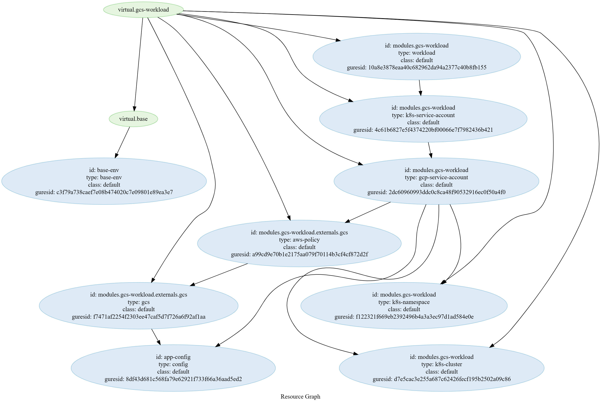
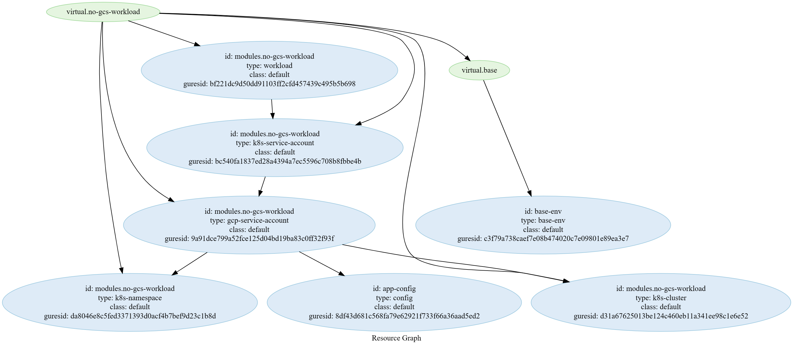
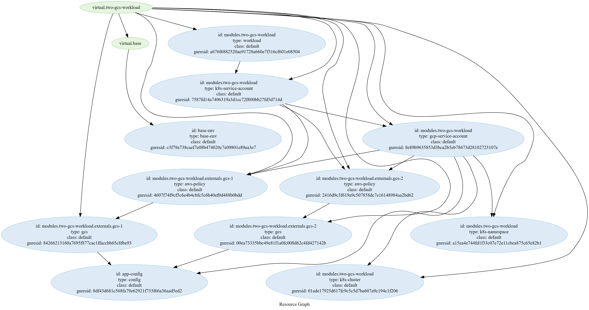

# Tests

```bash
APP=FIXME
ENVIRONMENT=FIXME
```

## Deploy with GCS

```mermaid
graph LR
  workload -- score --> gcs
  gcs -- co-provisions -->  aws-policy
  aws-policy -- references --> gcs
  workload -- references --> k8s-service-account
  k8s-service-account -- references --> google-service-account
  google-service-account -- selects --> aws-policy
```

```bash
make with-gcs
```

Should get successfull requests in the logs:
```bash
kubectl logs \
    -l app.kubernetes.io/name=gcs-workload \
    -n ${ENVIRONMENT}-${APP}
```

Should return a KSA with the WI annotation:
```bash
kubectl get sa gcs-workload \
    -n ${ENVIRONMENT}-${APP} \
    -o yaml
```

Should return a GSA:
```bash
gcloud iam service-accounts list | grep gcs-workload
```

Generated resource graph:


## Deploy without GCS

```mermaid
graph LR
  workload -- references --> k8s-service-account
```

```bash
make without-gcs
```

Should return a KSA without the WI annotation:
```bash
kubectl get sa no-gcs-workload \
    -n ${ENVIRONMENT}-${APP} \
    -o yaml
```

Shouldn't return a GSA:
```bash
gcloud iam service-accounts list | grep no-gcs-workload
```

Generated resource graph:


## Deploy with 2 GCS

```mermaid
graph LR
  workload -- score --> gcs-1
  workload -- score --> gcs-2
  gcs-1 -- co-provisions -->  aws-policy-1
  gcs-2 -- co-provisions -->  aws-policy-2
  aws-policy-1 -- references --> gcs-1
  aws-policy-2 -- references --> gcs-2
  workload -- references --> k8s-service-account
  k8s-service-account -- references --> google-service-account
  google-service-account -- selects --> aws-policy-1
  google-service-account -- selects --> aws-policy-2
```

```bash
make with-2-gcs
```

Should get successfull requests in the logs:
```bash
kubectl logs \
    -l app.kubernetes.io/name=two-gcs-workload \
    -n ${ENVIRONMENT}-${APP}
```

Should return a KSA with the WI annotation:
```bash
kubectl get sa two-gcs-workload \
    -n ${ENVIRONMENT}-${APP} \
    -o yaml
```

Should return a GSA:
```bash
gcloud iam service-accounts list | grep two-gcs-workload
```

Generated resource graph:
